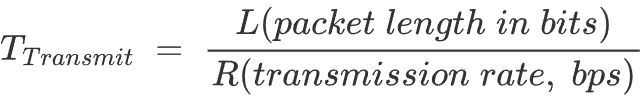
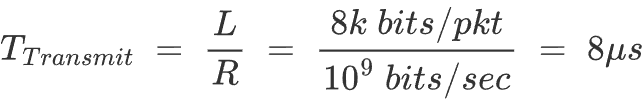
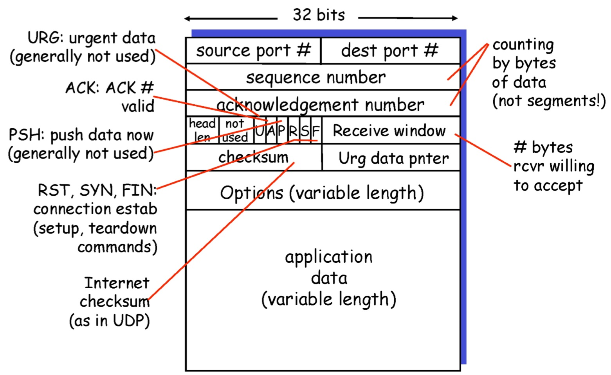
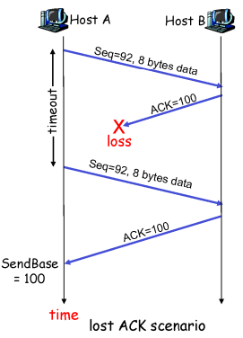
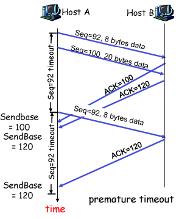
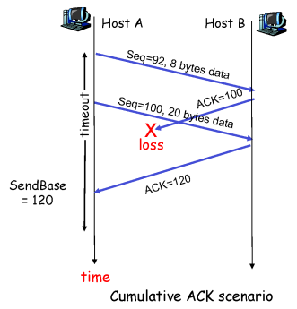

# 3️⃣ 전송계층 1

 

## Principles of reliable data transfer

### RDT 3.0

- 장점 : 신뢰성 ↑

- 단점 : 느린 속도
  
  

- Utilization

**[example]**

1Gbps link, 15ms propagation delay, 8000 bit/packet

→ 보낼 때 15.008ms 소요, 왕복 30.008ms 소요

 

### Pipelined protocols

- **Pipelining** : sender에서 receiver로 한번에 여러개의 packet을 보냄

   	- sequence number의 범위를 늘릴 것
		
   	- sender와 receiver에 buffering 필요

- pipelined protocol의 generic forms

  - **go-back-N**
  - **selective repeat**

**[example]**

**3-packet pipelining** → increases utilization by a factor of **3**

 

### Go-Back-N

- window : 몇 개의 packet을 보낼지 결정
- ACK를 받기 전에 N개의 packet을 전송
- 보내는 N개의 packet은 sender buffer에 저장됨(재전송해야할 수도 있기 때문)
- packet의 header에는 k bit의 sequence number 포함
- packet loss 또는 timeout 발생 시 N개 이전의 packet을 재전송
- **ACK(n)** : n번 packet까지 완벽하게 받았고, n+1번 packet을 기다리는 중임을 알림

- **timeout(n)** : n번 packet을 재전송하고, 그보다 높은 sequence number packet들은 window에 있음을 알림

 

### Selective Repeat

- sender는 ACK를 받지 못한 packet만 재전송함
- N개의 연속된 sequence num를 가짐
- sequence number : duplicate / new packet을 구별하기 위해 window size에 맞춰 최소 seq. num을 결정할 필요가 있음
- 각각의 packet에 대해 timer 설정이 필요하므로 window 사이즈↑ → timer 수 ↑
  - network 상의 부담은 덜하지만 receiver에서 처리해야하는 양이 많아짐
  - TCP 에서는 window의 대표 timer를 설정함

 

## Connection-oriented transport : TCP

### Overview

1. **point-to-point** : 하나의 process와 다른 하나의 process가 쌍을 이룸
2. **reliable** & **in-order byte stream**
3. **pipelined** : window size에 맞게 한번에 여러개의 packet을 전송
4. full duplex data : 데이터가 양방향으로 송수신되므로 양 측은 sender와 receiver의 역할을 모두 수행함
5. **connection-oriented** : handshaking
6. **flow controlled** : receiver의 buffer 공간만큼 알맞의 양의 data를 정송할 것

- sender buffer : 재전송 목적, ACK 올 때까지 저장
- receiver buffer : out-of-order packet 버리지 않고 저장하기 위한 목적

 

### TCP segment structure

- port number : 16bit 씩 차지, 0 ~ 2^16 - 1 개 (약 6만 개) 사용 가능
- **Receiver window** : receiver buffer 빈공간 크기를 알려주기 위함
- checksum : error 유무 판단

 

### Sequence number and ACK

- Sequence number : 전송하는 segment data의 첫번째 바이트의 number를 seq. #로 사용
- ACK : 받아야할 다음 byte의 seq. #

 

### TCP Round Trip Time and Timeout

- TCP timeout value 결정?
  - RTT보다는 길게 설정
  - 너무 짧은 경우? timeout이 빠르게 발생하므로 불필요한 재전송 발생
  - 너무 긴 경우? segment loss의 reaction이 너무 늦어짐
- RTT 추정 방법?
  - SampleRTT : segment를 전송하고 ACK가 올 때까지 걸린 시간

$$
EstimatedRTT\;=\;(1-\alpha)*EstimatedRTT\;+\;\alpha * SampleRTT
\\typical\;value:\;\alpha \;=\;0.125
$$

▶ **timeout 설정**

 - EstimatedRTT 값에 margin 값을 추가 (EstimatedRTT 값이 클수록 margin 값도 커짐)

$$
DevRRR\;=\;(1-\beta)*DevRTT\;+\;\beta *|SampleRTT\;-\;EstimatedRTT|
$$

$$
TimeoutInterval\;=\;EstimatedRTT\;+\;4\;*\;DevRTT
$$

 

### TCP reliable data transfer

1. **pipelined segments**
2. **Cumulative acks**
3. TCP uses **single retransmission timer**

- 재전송하는 경우?
  - timeout 발생 시
  - duplicate ACKs 발생 시

 

### TCP sender events

- app.으로부터 data를 받은 경우

  - seq. # 를 가지고 segment 생성

  - segmnet의 첫번째 data byte의 number를 seq. #로 설정

  - timer가 실행 중이 아니라면 timer 시작
  - interval의 기한 설정 : TimeOutInterval

- timeout 발생한 경우

  - timeout을 발생시킨 segment 재전송
  - timer 재실행

 

### Retransmission scenarios

1. ACK 정보가 유실된 경우

2. timeout이 짧게 설정되어 있는 경우

3. ACK가 누적되는 경우

→ timeout 발생 시? 재전송

→ timeout 전에 packet의 유실을 판단할 수 있는 방법?

​	duplicate ACK를 연속해서 3개 받은 경우(즉, 총 4개의 같은 ACK를 받은 경우) 유실 판단

​	**"fast retransmit"** : TCP에서 권고하는 mechanism

→ ACK 유실 시? delay 이후에 ACK 전송(보낼 data에 ACK 정보를 합쳐서 보내는 방법 外)