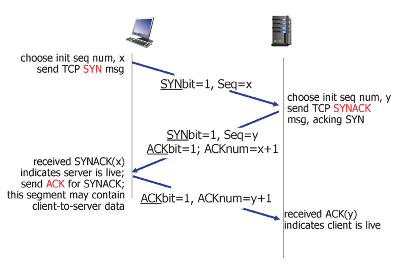
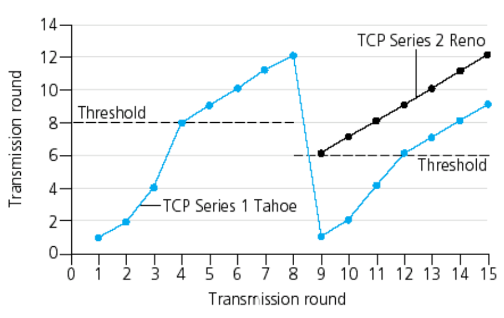

# 4️⃣ 전송계층 2

<br>

## Flow Control

- sender는 receiver의 buffer보다 더 많은 양을 보내지 않는다는 의미
- **speed-matching service** : 보내는 속도와 receiver의 app에서 처리하는 속도를 맞추는 서비스

- receiver에서 sender로 응답할 때 segment의 header에 buffer의 남은 크기를 알려주는 정보(RcvWindow)를 담아 전송

  ``` spare room in buffer = RcvWindow = RcvBuffer - [LastByteRcvd - LastByteRead] ```

❓ reciever buffer에 남아 있는 공간이 없는 경우?

​	sender는 receiver로부터 0을 수신하고 계속 대기 상태인 문제 발생

​	따라서, sender는 주기적으로 임의의 값을 보내서 ack를 수신하여 상태를 확인

<br>

## Connection Management

### Recall

- TCP sender와 receiver는 segment를 송수신하기 전에 connection을 먼저 해야함

1. TCP 변수를 초기화
   - sequence number
   - buffers, flow control info(e.g. RcvWindow)
2. client : connection 시작점
3. server : client에 의해서 연결됨

<br>

### 3 way Handshake

1. **client : server에게 TCP SYN segment 전송**
   - data 없음
   - 초기 sequence number 전송
2. **server : SYN을 수신하고 SYNACK segment 전송**
   - buffer 할당
   - 서버의 초기 sequence number 전송
3. **client : SYNNACK 수신**
   - ACK segment 송신
   - data 포함 가능



<br>

### Closing TCP Connection

1. client : server에게 TCP FIN control segment 전송
2. server : FIN 수신, ACK 응답 / FIN 전송
3. client : FIN 수신, ACK 응답
   - **Timed wait** : ACK가 확실히 전달되도록 기다리기
4. server : ACK 수신, connection close

<br>

## Principles of congestion control

[congestion control의 2가지 접근법]

1. End-End congestion control
   - network로부터 feedback없음
   - end system에서 loss, delay를 보고 혼잡도 결정
   - TCP가 사용하는 접근법
2. Network-assisted congestion control
   - router가 end system으로 feedback 전달
     - 혼잡도를 가르키는 single bit (SNA, DECbit, TCP/IP ECN, ATM)

<br>

## TCP Congestion Control

**[3단계]**

1. **Slow Start**

   - TCP connection, 실제 보내는 양은 window size(ACK 없이 한번에 보낼 수 있는 양)가 결정하므로 window size는 중요한 역할을 함

   - 따라서 초기 window size는 1 MSS 로 설정 

   - connection 시작 후, 첫번째 유실이 발생할 때까지 전송 data 양 **exponential 증가**

     → 초기 속도는 느리지만 기하급수적으로 빠르게 증가함

2.  **Additive increase**

   - **congestion window size가 threshold에 도달 시, data 양이 linear 증가**

3. **Multiplicative decrease**

   - network는 공공재이기 때문에, 과부하로 이상이 생기면 다른 user에게도 영향이 있음
   - 따라서 step2에서 linear 하게 증가하다가 step3에서 훅 줄임

<br>

- sender의 전송 속도

$$
rate = \frac{CongWin}{RTT}[bytes/sec]
$$

​		→ RTT (round trip time) : 데이터 송신 후 수신을 받는데 걸리는 시간

​		→ CongWin : network의 혼잡도에 따라 결정되는 요소

- TCP에서 packet 유실 탐지 방법? (sender가 혼잡함을 인지하는 방법)
  1. timeout 발생 시
  2. 3 duplicate ACK 수신 시

<br>

### 🌟Refinement 



📌 **y 축 : congestion window size**

📌 **TCP Series 1 Tahoe**

- 80년대 초 개발

  - transmission round = 1
    - network 상황을 모르기 때문에 MSS 1로 시작 → 2배씩 증가
  - transmission round = 4
    - Threshold 도달 시 → 1씩 증가
  - transmissiont round = 8
    - packet 유실 탐지
  - transmission round = 9
    - 다시 MSS 1 부터 시작
    - 이때 Treshold 값은 packet 유실 때의 window size의 절반이 됨

📌 **TCP Series 2 Reno**

- transmission round = 9
  - Timeout 발생 시 : MSS 1부터 시작, Threshold 값은 packet 유실 때의  window size의 절반
  - 3 duplicate ACK 수신 시 : 새로운 Treshold 값부터 linear 하게 증가

<br>

## TCP Fairness

- K개의 TCP session(독립 수행)이 BW가 R인 동일한 bottleneck link를 공유하고 있다면,

  각각의 session은 R/K의 평균 속도를 가짐