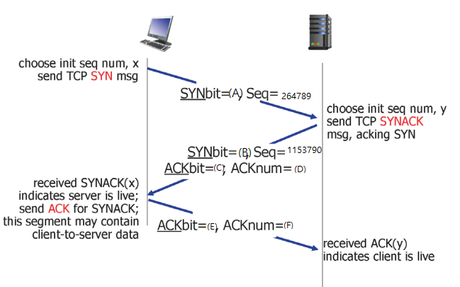

# 4주차_학습퀴즈 전송계층

1. TCP의 중요 기능으로 올바른 것을 모두 고르시오
```agsl

(1) packet routing
(2) flow control
(3) congestion control
(4) reliable data transfer

```
   <br>
   정답 : (2), (3), (4) 
   <br>
   <br>

2. TCP 헤더에 대한 설명으로 옳지 않은 것은?
```agsl
(1) TCP 제어 플래그 중 SYN는 3 way handshake에서 사용한다. 
(2) TCP 제어 플래그 중 ACK는 SYN 세그먼트 전송 이후 모든 세그먼트에는 항상 이 비트가 1로 세팅된다.
(3) Sequence Number는 항상 0값으로 시작하여, 최댓값 이후에는 '0'으로 되어 시작함
(4) Window Size는 16비트 필드로, TCP 흐름제어를 위해 송신자에게 자신의 수신 버퍼 여유용량 크기를 지속적으로 통보한다.
```
   <br>
   <br>

정답 : (3)

   <br>

3. Flow Control와 TCP에 대한 설명으로 옳은 것을 모두 고르시오.
```agsl
(1) Sender가 Receiver에게 데이터를 전송할 때 receiver의 수용 능력에 맞게 데이터를 전송하는 것이다.
(2) receiver는 자신의 상태를 TCP segment header에 receiver buffer 필드에 담아서 보내준다.
(3) TCP가 생성 되면 내부에 각자 2개의 버퍼가 생성된다.
(4) Receiver의 버퍼의 양만큼 데이터를 전송할 수 있기 때문에 전송량을 결정하는 것은 Receiver이다.
 ```
<br>
 정답 : (1) , (2) , (3) 
<br>
<br>

4. 3 - way handshake문제

상황이 다음과 같을 때 빈칸에 들어갈 숫자를 띄어쓰기로 구분하여 작성하시오.



<br>

정답 : (A) 1 (B) 1 (C) 1 (D) 264790 (E) 1 (F) 1153791 
<br>
<br>

5. 클로징 TCP 커넥션 문제
Closing TCP Connection 순서를 알맞게 작성하시오 (숫자만 띄어쓰기로 구분)
```text
(1) 서버가 클라이언트에게 헤더에 FIN을 담은 세그먼트를 보낸다.
(2) 클라이언트가 서버에게 헤더에 FIN을 담은 세그먼트를 보낸다.
(3) 서버가 남아 있는 데이터를 모두 전송한다.
(4) Timed Wait
(5) 클라이언트가 서버가 보내 준 FIN에 대한 ACK를 보낸다.

```
   <br>
   <br>

정답 : 2 3 1 5 4

   <br>
   <br>

6.
TCP Reno 방식을 사용하고 있고 현재 windowsize가 200 이었다. 동일한 seq#의 ACK를 총 4번 받았을 때 threshold와 windowsize는?

   <br>
   <br>
   정답  : windowsize 100 threshold 100   
   <br>
   <br>

7.
TCP Reno 방식을 사용하고 있고 현재 windowsize가 200 이었다. 동일한 seq#의 ACK를 총 4번 받았을 때 threshold와 windowsize는?

   <br>
   <br>
   정답  : windowsize 1 threshold 100   
   <br>
   <br>