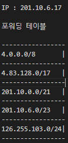

1. 하나의 호스트가 가질 수 있는 IP주소의 개수?

        호스트가 가지고 있는 NIC의 개수만큼

2. destination IP와 fowarding table이 다음과 같을 때 outgoing link는?
 
    

        201.10.6.0/23

3. IPv4 주소가 70.12.103.177 이고 서브넷 마스크가 255.255.255.0일 때 호스트 아이디와 IP 주소의 개수는?

        177, 2^8 = 256 개