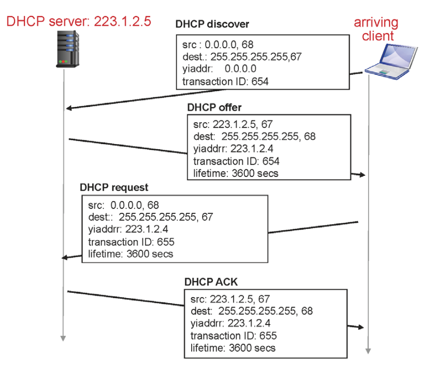

# 6️⃣ 네트워크 계층 2

 

## NAT (Network Address Translation)

- gateway router의 역할

  - Outbound: source IP addr를 router의 ip 주소로 바꿔서 전달
  - Inbound : dest IP addr를 subnet 내부의 클라이언트 주소로 바꿔서 전달

- 발생할 수 있는 문제점

  1. 디자인 상의 문제

     router의 역할은 패킷의 header를 보고 forwarding해주는 것이지만, router가 패킷의 ip 주소와 데이터를 고쳐버리기 때문에 layer가 무너짐

  2. 현실적인 문제

     dest. ip adrr. → host 탐색

     dest. port addr. → process 탐색

     위처럼 동작해야하나, NAT에서는 port addr.로 host를 탐색하기 때문에 실제 process를 찾을 방법이 없음

📢 NAT 기술은 IPv4를 계속 사용할 수 있도록 하는 일종의 트릭으로, 주소 부족 문제를 해결할 수 있는 방법은 아님

📢 새로운 프로토콜 도입의 어려움 존재 (ex. 통신사업기업과 같은 생태계적인 문제)

 

## DHCP (Dynamic Host Configuration Protocol)

- 인터넷 연결 시 필요한 정보

  1. IP
  2. subnet mask
  3. router
  4. DNS : local name server의 ip 주소가 저장됨

  → 만약 router와 DNS가 같다면?

  ​		router 안에서 local name server의 프로세스가 동작함을 의미

  → router와 DNS 주소는 **DHCP** 가 설정

 

예) 학생 A가 노트북을 사용한 뒤 다른 장소로 이동해서 다시 노트북을 사용하려고 하는 경우

→ 노트북의 네트워크는 다른 정보로 새롭게 세팅 (DHCP가 하는 일)

→ 이러한 과정을 동적으로 진행하는 이유?

​		사용자는 계속해서 움직이기 때문에 자동화된 configuration 동작이 필요

→ 고정된 IP를 쓴다면?

​		흔치 않지만, 이러한 경우 有

​		IP주소가 너무 많이 필요하게 되고 금전적 손실 발생

→ 동시에 active 상태인 사용자들만큼만 IP 주소 사용

​		일정 시간이 지나면 해당 주소를 회수

 

- DHCP client-server scenario

1. client가 특정 서버로 들어와서 접속을 시도

   연결에 필요한 정보 모두 알지 못하는 상태

   서버 내의 모든 멤버에게 DHCP discover message 전송

   ​	src: 0.0.0.0, 68

   ​		0.0.0.0 → 아직 IP 주소가 정해지지 않은 상태

   ​		68 → DHCP client로서 68번을 사용할 것을 알림

   ​	dest: 255.255.255.255, 67 

   ​		255.255.255.255 → 32bit로 봤을 때  모두 1, **broadcast**

   ​		broadcast → subnet에 있는 모든 멤버에게 메세지 뿌리기

   ​		67 → port number, DHCP 서버는 67에서 동작 중인 상태

   ​	yiaddr, transaction → 랜덤 정보

   해당 메세지는 서버만 반응해야하고 다른 멤버는 무시할 것

   ​	→ destnation이 255.255.255.255라서 모든 멤버가 받고 67번 포트로 올라가지만 DHCP만 67번 포트를 열고 listen하고 있기 때문에 서버만 반응

2. DHCP의 offer 전송

   src ip, port number는 자기 자신으로, destnation은 broadcast

   client가 누군지 모르기 때문에, 모든 멤버가 메세지를 받고 해당 client만 반응

   yiaddr → 지금부터 일정 시간동안 사용할 수 있다고 offer

3. client의 DHCP request 전송

   offer에 대한 request 전송

   transaction 번호 + 1 전송

4. DHCP ACK 전송

   전송된 IP 주소를 client의 IP주소로 사용 가능

→ client의 ip 주소는 외부적으로 고유한 값은 아님

→ 무선 공유기의 경우?

​		무선 공유기 : gateway router 역할, 하나의 subnet

​								같은 공유기를 쓰는 사람들은 같은 prefix를 가짐

​								내부적으로는 다른 IP를 갖지만 외부로 패킷을 보낼 때는 같은 IP주소를 사용

 

## IP fragmentation, reassembly

→ IP 패킷 header의 length(header 20 bytes 포함)가 링크의 MTU(Maximum Transfer Size)보다 큰 경우? (MTU : 링크에서 한 번에 보낼 수 있는 데이터 유닛의 최대값)

​	패킷이 더 크다면 drop, 현재 IPv4에서는 패킷이 크면 바로 분리해서 독립적인 프레임으로 나누어 보내고, 나중에 원래 패킷으로 합쳐짐

- fragflag : 이후에 나눠진 프레임 조각이 있음을 알려줌
- offset : 기존 데이터에서 잘려진 부분을 가르키는 point

 

## ICMP (Internet Control Message Protocol)

- 인터넷 프로토콜, 네트워크 층에서 가장 중요한 프로토콜, 유저 데이터를 운반하는 유일한 프로토콜

- IP 패킷의 데이터 부분에는 실제로 주고받고자 하는 메세지가 담기는데, 99% 이상 TCP segment가 들어감

